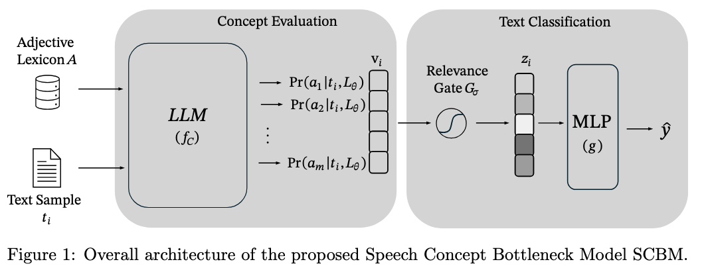

# SCBM
Official repository for the paper "Distilling Knowledge from Large Language Models: A Concept Bottleneck Model for Hate and Counter Speech Recognition", in which we propose Speech Concept Bottleneck Models (SCBMs), a novel approach for automated hate and counter speech recognition.

🔗 Link to paper: tbd
🔗 Link to preprint: tbd

# Adjectival Feature Analysis for Abuse Detection


A research source code investigating adjective-based feature analysis for hate speech detection and counter speech classification using transformer models and a proposed  `Speech Concept Bottleneck Model (SCBM)`. 

## Table of Contents
1. [Features](#features)
2. [Model Architecture](#model-architecture)
3. [Repository Layout](#repository-layout)
4. [Training & Evaluation](#training--evaluation)
5. [SCBM Representation Computation](#scbm-representation-computation)
6. [Training and Evaluation of SCBM and SCBM-T](#training-and-evaluation-of-scbm-and-scbm-t)
7. [Zero-shot Evaluation on GPT Family](#zero-shot-evaluation-on-gpt-family)


## Features

- **Multi-Dataset Support**: 
  - GermEval 2018 (German offensive language) [no context]
  - TSNH (Thou Shalt Not Hate - Italian counter speech) [no context]
  - HS_CS (Hate Speech vs Counter Speech)
  - CONAN (COunter NArratives)
  - ELF22 (Empathetic Language for Fighting Hate 2022)
  
- **Model Architectures**:
  - BERT-style transformers (`bert-base-german-cased`, `xlm-roberta-large`, etc.)
  - Custom interpretable models with feature masking (SCBM)
  - GPT-3.5/GPT-4/Llama3.1-8b-instruct zero-shot baselines
  
- **Key Functionalities**:
  - Adjective-based feature importance analysis
  - Feature sentitivity through Permutation importance calculations
  - Attention mask visualization to offer prediction interpretations
  - Prompt sensitivity studies, to evaluate the impact of the personas when computing SCBM representation
  - Cross-dataset performance evaluation

## Model Architecture

SCBM is designed for hate and counter speech recognition by integrating human-interpretable adjective-based concepts as a bottleneck layer between input text and classification.



SCBM leverages adjectives-based represetation as semantically meaningful bottleneck concepts derived probabilistically from LLMs, then classifies texts via a transparent, light-weight classifier that learns to prioritize key adjectives. This results in competitive hate and counter speech recognition performance with strong interpretability compared to black-box transformer models.
In this repository, files are named `Mc` referencing to `SCBM` and `Mb` referencing to `SCBM-T` which are described in the paper submitted to IPM. In the same way `Mc-L` make reference to the regularized version of `SCBM`, i.e., `SCBM-R`.

## Repository Layout

```text
.
├── README.md                          # Main readme for repository overview
├── adjectives_sortd_en.csv            # CSV data file (adjectives sorted)
├── probabilities.ipynb               # Jupyter notebook, likely for probabilistic analysis
├── conan                            # Directory with pickle models & scripts (likely ML models)
│   ├── inference_L31_zero_context.py  # Script for zero-context inference (social psychology model)
│   ├── main_transformers.py           # Transformer-related main script within conan to run model training and inference with baseline
│   ├── train.csv                      # Training dataset CSV
│   ├── test.csv                      # Test dataset CSV
│   ├── *.pickle                      # Pickle files for models, datasets, or intermediate data
│   └── llm            
│       └── models.py                 # Model definitions, training and evaluation functions for transformer baseline  for connan dataset            
│
├── elf22                           # Similar structure to conan, another model/data set repository
│   ├── inference_L31_zero_context.py # Similar inference script for elf22 dataset/model
│   ├── main_transformers.py          # Main transformer script specific to elf22 to run model training and inference with baseline
│   ├── train.csv                      # Training dataset CSV
│   ├── test.csv                      # Test dataset CSV
│   ├── *.pickle                      # Pickle files for models, datasets, or intermediate data
│   └── llm            
│       └── models.py                 # Model definitions, training and evaluation functions for transformer baseline  for elf22 dataset     
│
├── hs_cs                          # Another project/dataset folder, presumably related to Hate Speech Classification
│   ├── inference_L31_zero_context.py # Inference script for zero context
│   ├── main_transformers.py       #Main transformers script to run model training and inference with baseline
│   ├── datasets, pickles          # CSV data and pickle files for training/testing
│   ├── train.csv                      # Training dataset CSV
│   ├── test.csv                      # Test dataset CSV
│   ├── *.pickle                      # Pickle files for models, datasets, or intermediate data
│   └── llm            
│       └── models.py                 # Model definitions, training and evaluation functions for transformer baseline  for hs_cs dataset 
│
├── germeval                    # Germeval dataset related files and models
│   ├── inference_L31_zero_nocontext.py # Inference script for Germeval dataset to compute scbm representation
│   ├── train.csv                      # Training dataset CSV
│   ├── test.csv                      # Test dataset CSV
│   ├── *.pickle                      # Pickle files for models, datasets, or intermediate data
│   ├── main_transformers.py       # Main transformers script to run model training and inference with baseline
│   └── llm            
│       └── models.py                 # Model definitions, training and evaluation functions for transformer baseline  for hs_cs dataset 
│
├── tsnh                         # TSNH dataset and related scripts/models
│   ├── inference_L31_zero_nocontext.py # Zero context inference script
│   ├── main_transformers-thsn.py # Main transformer script for tsnh
│   ├── TSNH_uniform.csv        # Uniform TSNH dataset CSV, here there is no train/test we use cross-validation instead to evaluate the model performance
│   ├── *.pickle                      # Pickle files for models, datasets, or intermediate data
│   └── llm            
│       └── models.py          # Model definitions, training and evaluation functions for transformer baseline  for tsnh dataset 
│
├── features_sensitivity           # Feature sensitivity analysis scripts and data
│   ├── Mc.py                    # Model and training scripts SCBM used to do inference and evaluate the feature sensitivity in the jupyter notebook
│   ├── McL.py                   # Model and training scripts SCBM-R used to do inference and evaluate the feature sensitivity in the jupyter notebook
│   ├── *.pdf, *.png, *.eps     # Feature visualizations for our IPM paper 
│   ├── masks.ipynb               # Notebook for masks visualization to evaluate which are the relevant adjectives to the classifiacation
│   ├── run1.py, run2.py          # Run scripts for experiments on connan and tsnh respectively
│   ├── *.pt              # Model checkpoints for corresponding dataset and variants of the scbm
│   ├── weights_germeval          # Model weights folder for Germeval dataset
│   └── weights_tsnh              # Model weights folder for TSNH dataset when evaluating the impacto of using more or less features (adjectives, concepts) this is relate to experiment in section 5.4 of the IPM paper
│
├── prompt-sensitibity            # Experiments on prompt (persona) sensitivity with notebooks and data (Section 5.4 of IPM paper)
│   ├── inference_L31.py          # Inference script with Llama 3.1 model on the prediction of adjectives probabilities
│   ├── main_context.py,main_nocontext.py          # Script for model training with/wothout context while variating the representation resulting from inference_L31.py with different prompts.
│   ├── main.ipynb                # Main analysis notebook
│   ├── *.pdf, *.eps     # Feature visualizations for our IPM paper 
│   └── *.csv        # Data files 
│
├── Mc+Mb                    # Various model scripts, mostly with Mc (SCBM) and Mb (SCBM-T) with and without regularization to run experiments in paralell with different datasets
│   ├── Mb+L-tsnh.py, Mc+L-tsnh.py           # Training/inference script for Mb+L and Mc+L on tsnh dataset, this is particualrly different because requires cross-validation
│   ├── Mb-tsnh.py, Mc-tsnh.py           # Training/inference script for Mb and Mc on tsnh dataset, this is particualrly different because requires cross-validation
│   └─── Mc.py, Mb.py           # Model implementation scripts
│
├── Llama                        # LLaMA model and inference scripts using context (or not) to compute SCBM representations
│   ├── inference_L31_context.py # LLaMA inference for datasets where instances have context
│   ├── inference_L31_no_context.py # LLaMA inference where instances have no context
│   ├── main_context.py          # Main script for LLaMA with context
│   └── main_nocontext.py        # Main script for LLaMA without context
│
└── zero-shot                    # Zero-shot inference scripts with GPT models
    ├── gpt3.5_context.py, gpt3.5_nocontext.py         # GPT-3.5 with context and no context inference script, the usage depends on the dataset
    └── gpt4_context.py, gpt_nocontext.py          # GPT-4 with context and no context inference script, the usage depends on the dataset

```

## Training & Evaluation

Each dataset folder (`conan`, `elf22`, `germeval`, `hs_cs`, `tsnh`) contains two main scripts: `main_transformer.py` and `inference_L31_zero_context.py`. The former is responsible for training the models, while the latter is used for inference in a zero-shot manner using [`Llama-3.1-8b-instruct`](https://huggingface.co/meta-llama/Llama-3.1-8B-Instruct).

Each `main_transformer.py` follows a common structure, adapted only to the specific characteristics of its corresponding dataset. The general workflow starts with the manual definition of four Transformer models, selected as baselines in the paper published in *Information Processing & Management (IPM)*: [`FacebookAI/xlm-roberta-base`](https://huggingface.co/FacebookAI/xlm-roberta-base), [`FacebookAI/xlm-roberta-large`](https://huggingface.co/FacebookAI/xlm-roberta-large), [`google-bert/bert-base-uncased`](https://huggingface.co/google-bert/bert-base-uncased), [`google-bert/bert-large-uncased`](https://huggingface.co/google-bert/bert-large-uncased). For each of these models, five independent training runs are performed, followed by evaluations to obtain the average performance and standard deviation. Finally, the results are serialized and saved in `.pickle` files for later analysis. They can be runned by performing the following command according to the dataset:

```bash
cd elf22
python main_transformer.py
```

Similarly to run the zero-shot inference it should be done:


```bash
cd elf22
python inference_L31_zero_context.py
```

## SCBM Representation Computation

The `Lama` folder contains the inference and training logic to compute representations for the Speech Concept Bottleneck Model (SCBM) representation using the [`Llama-3.1-8b-instruct`](https://huggingface.co/meta-llama/Llama-3.1-8B-Instruct) model. 

The scripts `inference_L31_context.py` and `inference_L31_nocontext.py` are responsible for loading pretrained models and generating representations with and without context, respectively (depending on the dataset processed). The files `main_context.py` and `main_nocontext.py` coordinate the inference process by calling the inference scripts to extract the necessary representations for the SCBM experiments.
Notice the dataset should be specified in the corresponding `main_*.py` file by editing it. Finally to run the computation only the following command needs to be run:

```bash
cd Llama
python main_nocontext.py
```

> **Note:**
> When processing a dataset with contextual information `main_nocontext.py` shall be run. Also notice the first time this opration may be slow at the beginning becasue the model needs to be downloaded.

# Training and Evaluation of SCBM and SCBM-T

The `Mc+Mb` folder contains scripts used to train and evaluate the proposed SCMB (Speech Concept Bottleneck Models) on the datasets. The files `Mb.py` (`SCBM-T`) and `Mc.py` (`SCBM`) correspond to two independent variants of the model, each of which can be run directly from the command line using Python. Each script performs five training runs with their respective evaluations to calculate the mean and standard deviation of the results. This procedure reproduces the performance reported in the published *Information Processing & Management (IPM)* paper.

Model weights are automatically saved in a local directory defined inside each script as a `*.pt` file, along with evaluation results serialized as `.pickle`. Below is a basic example of how to run each variant:

```bash

#change to the correct directory
cd Mc+Mb

# Train and evaluate the Model Bottleneck variant
python Mb.py

# Train and evaluate the Model Concept variant
python Mc.py
```
### Special case: TSNH dataset

For the TSNH dataset, which does not have predefined training, validation, and test splits, the Mb-tsnh.py and Mc-tsnh.py scripts implement a cross-validation scheme. The splits are generated internally and kept consistent across the five training repetitions.

### Regularized variant: +L (SCBM-R)

To improve model interpretability, regularized versions of each variant are included under the names pluseL.py. These versions add penalties to the model aiming to produce more interpretable and structured representations without sacrificing predictive performance. Their usage is identical:

```bash
# Train and evaluate the regularized Model Bottleneck variant
python Mb+L.py

# Train and evaluate the regularized Model Concept variant
python Mc+L.py
```

#### Customization and Configuration

The training scripts (`Mb.py`, `Mc.py`, `Mb+L.py`, `Mc+L.py`) contain hardcoded parameters and file paths that need to be adjusted directly within the script before execution. Key customizable elements typically include:

- **Dataset file paths** for training and testing CSV files:
  ```python
  train_file_name = '../hs_cs/train.csv'
  test_file_name = '../hs_cs/test.csv'
  ```
- **Output directories and filenames** for saving model weights and evaluation results:
  ```python
  output = '.'  # Directory to save weights
  output_name = 'Mc'  # Prefix for saved model weights (e.g., Mc.pt)
  results_pickle_path = '../hs_cs/Mc.pickle'  # Path to save evaluation metrics
  ```

- **Model hyperparameters**, such as number of epochs, batch size, learning rate, and hidden layer size:

  ```python
  epoches = 250
  batch_size = 128
  interm_layer_size = 128
  lr = 2e-3
  decay = 1e-6
  ```


## Zero-shot Evaluation on GPT Family

The `Zero Shoot` folder contains scripts used for evaluating GPT models in zero-shot mode. It includes files for GPT-3.5 and GPT-4, each with **Context** and **No Context** versions, depending on whether the task includes context or not.

Each script runs four inference passes per instance, sending requests to the GPT model to obtain predictions for the specific task. Then, a majority voting system is applied to determine the final prediction and to measure variability among GPT’s responses. The results are saved in files with the `.pickl` extension.

Key parameters and file paths are hard-coded within the scripts, so any modifications require directly editing the source code.

**Key aspects and handwritten configurations:**

- **API client setup:** The OpenAI client is initialized with a hardcoded API key (`api_key`).

- **Prompt definition:** 
  - The output is restricted to one of seven single-word categories: `"denouncing"`, `"hypocrisy"`, `"question"`, `"unrelated"`, `"humor"`, `"facts"`, or `"support"`. This should change according to the assesed classes in the task dataset.

- **Data input:** The script reads input data from a fixed CSV file path (`../conan/test.csv`), which contains columns for `id`, `text` (comment), and `context`.

- **Result storage:** After each run, results are saved as a pickle file for further analysis.
