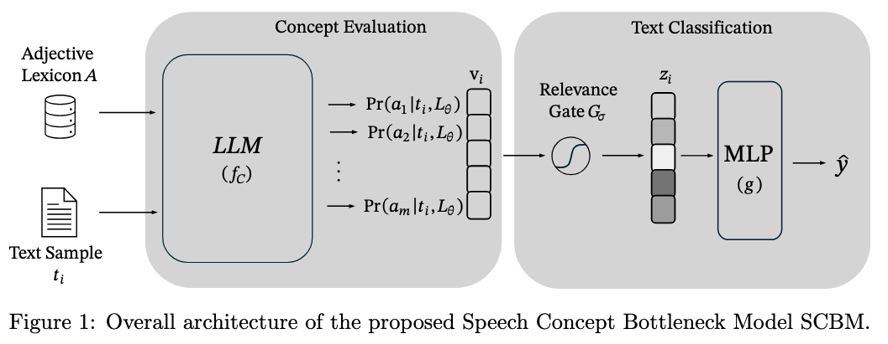

# SCBM
Official repository for the paper "Distilling Knowledge from Large Language Models: A Concept Bottleneck Model for Hate and Counter Speech Recognition", in which we propose Speech Concept Bottleneck Models (SCBMs), a novel approach for automated hate and counter speech recognition.

✨ SCBM brings interpretability to hate and counter speech recognition by routing decisions through human-readable adjective concepts.

🔗 Paper: https://www.sciencedirect.com/science/article/pii/S030645732500250X

## Repository index
- Adjective tools
  - ✨ Adjective generation: [AdjectiveSetGeneration](./AdjectiveSetGeneration/README.md)
  - 📖 Adjective definitions: [AdjectiveDefinition](./AdjectiveDefinition/README.md)
- SCBM representations and models
  - 🦙 LLaMA-based feature extraction: [Llama](./Llama/README.md)
  - 🎯 SCBM and SCBM-T training: [SCBM(T)](./SCBM%28T%29/README.md)
  - 🧪 Prompt/persona sensitivity: [prompt-sensitibity](./prompt-sensitibity/README.md)
- Baselines and zero-shot
  - ⚡ Transformer baselines: [Transformers_baseline](./Transformers_baseline/README.md)
  - 🔎 Zero-shot (OpenAI/LLaMA): [zero-shot-evaluation](./zero-shot-evaluation/README.md)
- 🧩 ICL & CoT experiments: [ICL & CoT experiments](./ICL%20&%20CoT%20experiments/README.md)
- 🗂️ Datasets overview: [Tasks](./Tasks/README.md)
  

## Table of Contents
1. [Quickstart](#quickstart)
2. [Model Architecture](#model-architecture)
3. [Results](#results)
4. [Training & Evaluation](#training--evaluation)
5. [SCBM Representation Computation](#scbm-representation-computation)
6. [Training and Evaluation of SCBM and SCBM-T](#training-and-evaluation-of-scbm-and-scbm-t)
7. [Zero-shot Evaluation on GPT Family](#zero-shot-evaluation-on-gpt-family)
8. [Citation](#citation)

## Quickstart

Follow these steps to reproduce the main pipeline end-to-end.

1) Install dependencies:

```bash
pip install -r requirements.txt
```

2) Compute SCBM features with LLaMA (writes .pickle next to CSV):

```bash
set -x HF_USER your-username
set -x HF_TOKEN your-token
python Llama/main.py \
  --input_files ./Tasks/germeval/train.csv \
  --use_context false \
  --adjectives_file ./AdjectiveSetGeneration/adjectives.csv
```

3) Train SCBM variants:

```bash
# SCBM (HS_CS)
python "SCBM(T)/SCBM.py" \
  --train_file_name ./Tasks/hs_cs/train.csv \
  --test_file_name ./Tasks/hs_cs/test.csv \
  --use_regularization false \
  --output_dir ./SCBM(T)
```

## Model Architecture

SCBM is designed for hate and counter speech recognition by integrating human-interpretable adjective-based concepts as a bottleneck layer between input text and classification.



SCBM leverages adjectives-based representation as semantically meaningful bottleneck concepts derived probabilistically from LLMs, then classifies texts via a transparent, lightweight classifier that learns to prioritize key adjectives. This results in competitive hate and counter speech recognition performance with strong interpretability compared to black-box transformer models.

## Results

We summarize quantitative performance across datasets and show qualitative explanation examples. 

### Overall performance 

Performance of all explored approaches in our paper across all employed datasets in terms of macro-$F_1$ score. The best-performing approach in each category is highlighted in italics, and the best-performing approach per dataset is highlighted in bold.

<table border="1">
  <thead>
    <tr>
      <th rowspan="2" style="text-align:center;"></th>
      <th colspan="2" rowspan="2" style="text-align:left;">Method</th>
      <th colspan="5" style="text-align:center;">Dataset</th>
    </tr>
    <tr>
      <th style="text-align:left;">GermEval</th>
      <th style="text-align:left;">ELF22</th>
      <th style="text-align:left;">HS-CS</th>
      <th style="text-align:left;">CONAN</th>
      <th style="text-align:left;">TSNH</th>
    </tr>
  </thead>
  <tbody>
    <tr>
      <td></td>
      <td colspan="2" style="text-align:left;">Random</td>
      <td style="text-align:left;">0.488</td>
      <td style="text-align:left;">0.515</td>
      <td style="text-align:left;">0.347</td>
      <td style="text-align:left;">0.109</td>
      <td style="text-align:left;">0.503</td>
    </tr>
    <tr>
      <td rowspan="5" style="text-align:center;">I</td>
      <td colspan="2" style="text-align:left;">SVM</td>
      <td style="text-align:left;"><i>0.648<sub>&plusmn;0.000</sub></i></td>
      <td style="text-align:left;">0.553<sub>&plusmn;0.000</sub></td>
      <td style="text-align:left;"><i>0.426<sub>&plusmn;0.000</sub></i></td>
      <td style="text-align:left;">0.364<sub>&plusmn;0.000</sub></td>
      <td style="text-align:left;"><i>0.696<sub>&plusmn;0.007</sub></i></td>
    </tr>
    <tr>
      <td colspan="2" style="text-align:left;">LR</td>
      <td style="text-align:left;">0.586<sub>&plusmn;0.000</sub></td>
      <td style="text-align:left;"><i>0.556<sub>&plusmn;0.000</sub></i></td>
      <td style="text-align:left;">0.413<sub>&plusmn;0.000</sub></td>
      <td style="text-align:left;">0.322<sub>&plusmn;0.000</sub></td>
      <td style="text-align:left;">0.693<sub>&plusmn;0.007</sub></td>
    </tr>
    <tr>
      <td colspan="2" style="text-align:left;">RF</td>
      <td style="text-align:left;">0.535<sub>&plusmn;0.009</sub></td>
      <td style="text-align:left;">0.531<sub>&plusmn;0.027</sub></td>
      <td style="text-align:left;">0.323<sub>&plusmn;0.014</sub></td>
      <td style="text-align:left;">0.259<sub>&plusmn;0.005</sub></td>
      <td style="text-align:left;">0.689<sub>&plusmn;0.005</sub></td>
    </tr>
    <tr>
      <td colspan="2" style="text-align:left;">GB</td>
      <td style="text-align:left;">0.571<sub>&plusmn;0.002</sub></td>
      <td style="text-align:left;">0.547<sub>&plusmn;0.027</sub></td>
      <td style="text-align:left;">0.374<sub>&plusmn;0.008</sub></td>
      <td style="text-align:left;">0.368<sub>&plusmn;0.005</sub></td>
      <td style="text-align:left;">0.668<sub>&plusmn;0.008</sub></td>
    </tr>
    <tr>
      <td colspan="2" style="text-align:left;">MLP</td>
      <td style="text-align:left;">0.648<sub>&plusmn;0.003</sub></td>
      <td style="text-align:left;">0.542<sub>&plusmn;0.010</sub></td>
      <td style="text-align:left;">0.398<sub>&plusmn;0.003</sub></td>
      <td style="text-align:left;"><i>0.386<sub>&plusmn;0.011</sub></i></td>
      <td style="text-align:left;">0.672<sub>&plusmn;0.005</sub></td>
    </tr>
    <tr>
      <td rowspan="10" style="text-align:center;">II</td>
      <td rowspan="2" style="text-align:left;">SVM</td>
      <td style="text-align:left;">Llama 2</td>
      <td style="text-align:left;">0.695<sub>&plusmn;0.029</sub></td>
      <td style="text-align:left;">0.356<sub>&plusmn;0.000</sub></td>
      <td style="text-align:left;">0.504<sub>&plusmn;0.000</sub></td>
      <td style="text-align:left;">0.593<sub>&plusmn;0.000</sub></td>
      <td style="text-align:left;">0.637<sub>&plusmn;0.090</sub></td>
    </tr>
    <tr>
      <td style="text-align:left;">Llama 3.1</td>
      <td style="text-align:left;"><i>0.779<sub>&plusmn;0.000</sub></i></td>
      <td style="text-align:left;">0.669<sub>&plusmn;0.000</sub></td>
      <td style="text-align:left;"><i>0.577<sub>&plusmn;0.000</sub></i></td>
      <td style="text-align:left;">0.602<sub>&plusmn;0.000</sub></td>
      <td style="text-align:left;">0.724<sub>&plusmn;0.010</sub></td>
    </tr>
    <tr>
      <td rowspan="2" style="text-align:left;">LR</td>
      <td style="text-align:left;">Llama 2</td>
      <td style="text-align:left;">0.693<sub>&plusmn;0.029</sub></td>
      <td style="text-align:left;">0.356<sub>&plusmn;0.000</sub></td>
      <td style="text-align:left;">0.504<sub>&plusmn;0.000</sub></td>
      <td style="text-align:left;">0.593<sub>&plusmn;0.000</sub></td>
      <td style="text-align:left;">0.646<sub>&plusmn;0.093</sub></td>
    </tr>
    <tr>
      <td style="text-align:left;">Llama 3.1</td>
      <td style="text-align:left;">0.777<sub>&plusmn;0.000</sub></td>
      <td style="text-align:left;">0.671<sub>&plusmn;0.000</sub></td>
      <td style="text-align:left;"><i>0.577<sub>&plusmn;0.000</sub></i></td>
      <td style="text-align:left;">0.602<sub>&plusmn;0.000</sub></td>
      <td style="text-align:left;">0.723<sub>&plusmn;0.009</sub></td>
    </tr>
    <tr>
      <td rowspan="2" style="text-align:left;">RF</td>
      <td style="text-align:left;">Llama 2</td>
      <td style="text-align:left;">0.689<sub>&plusmn;0.028</sub></td>
      <td style="text-align:left;">0.646<sub>&plusmn;0.010</sub></td>
      <td style="text-align:left;">0.466<sub>&plusmn;0.012</sub></td>
      <td style="text-align:left;">0.394<sub>&plusmn;0.012</sub></td>
      <td style="text-align:left;">0.604<sub>&plusmn;0.010</sub></td>
    </tr>
    <tr>
      <td style="text-align:left;">Llama 3.1</td>
      <td style="text-align:left;">0.757<sub>&plusmn;0.004</sub></td>
      <td style="text-align:left;"><i>0.671<sub>&plusmn;0.003</sub></i></td>
      <td style="text-align:left;">0.487<sub>&plusmn;0.009</sub></td>
      <td style="text-align:left;">0.486<sub>&plusmn;0.012</sub></td>
      <td style="text-align:left;">0.719<sub>&plusmn;0.005</sub></td>
    </tr>
    <tr>
      <td rowspan="2" style="text-align:left;">GB</td>
      <td style="text-align:left;">Llama 2</td>
      <td style="text-align:left;">0.729<sub>&plusmn;0.019</sub></td>
      <td style="text-align:left;">0.561<sub>&plusmn;0.000</sub></td>
      <td style="text-align:left;">0.500<sub>&plusmn;0.001</sub></td>
      <td style="text-align:left;">0.481<sub>&plusmn;0.000</sub></td>
      <td style="text-align:left;">0.642<sub>&plusmn;0.092</sub></td>
    </tr>
    <tr>
      <td style="text-align:left;">Llama 3.1</td>
      <td style="text-align:left;">0.766<sub>&plusmn;0.000</sub></td>
      <td style="text-align:left;">0.577<sub>&plusmn;0.001</sub></td>
      <td style="text-align:left;">0.562<sub>&plusmn;0.002</sub></td>
      <td style="text-align:left;">0.534<sub>&plusmn;0.002</sub></td>
      <td style="text-align:left;">0.721<sub>&plusmn;0.006</sub></td>
    </tr>
    <tr>
      <td rowspan="2" style="text-align:left;">MLP</td>
      <td style="text-align:left;">Llama 2</td>
      <td style="text-align:left;">0.743<sub>&plusmn;0.017</sub></td>
      <td style="text-align:left;">0.396<sub>&plusmn;0.079</sub></td>
      <td style="text-align:left;">0.481<sub>&plusmn;0.011</sub></td>
      <td style="text-align:left;"><i>0.627<sub>&plusmn;0.011</sub></i></td>
      <td style="text-align:left;">0.640<sub>&plusmn;0.096</sub></td>
    </tr>
    <tr>
      <td style="text-align:left;">Llama 3.1</td>
      <td style="text-align:left;">0.762<sub>&plusmn;0.018</sub></td>
      <td style="text-align:left;">0.654<sub>&plusmn;0.017</sub></td>
      <td style="text-align:left;">0.556<sub>&plusmn;0.014</sub></td>
      <td style="text-align:left;">0.618<sub>&plusmn;0.018</sub></td>
      <td style="text-align:left;"><i>0.728<sub>&plusmn;0.007</sub></i></td>
    </tr>
    <tr>
      <td rowspan="4" style="text-align:center;">III</td>
      <td colspan="2" style="text-align:left;">XLM-RoBERTa-base</td>
      <td style="text-align:left;">0.747<sub>&plusmn;0.017</sub></td>
      <td style="text-align:left;">0.645<sub>&plusmn;0.018</sub></td>
      <td style="text-align:left;">0.524<sub>&plusmn;0.008</sub></td>
      <td style="text-align:left;">0.729<sub>&plusmn;0.016</sub></td>
      <td style="text-align:left;">0.747<sub>&plusmn;0.013</sub></td>
    </tr>
    <tr>
      <td colspan="2" style="text-align:left;">BERT-base</td>
      <td style="text-align:left;">0.654<sub>&plusmn;0.040</sub></td>
      <td style="text-align:left;">0.670<sub>&plusmn;0.008</sub></td>
      <td style="text-align:left;">0.543<sub>&plusmn;0.004</sub></td>
      <td style="text-align:left;">0.721<sub>&plusmn;0.022</sub></td>
      <td style="text-align:left;">0.752<sub>&plusmn;0.022</sub></td>
    </tr>
    <tr>
      <td colspan="2" style="text-align:left;">XLM-RoBERTa-large</td>
      <td style="text-align:left;"><i>0.786<sub>&plusmn;0.004</sub></i></td>
      <td style="text-align:left;">0.680<sub>&plusmn;0.008</sub></td>
      <td style="text-align:left;"><i>0.572<sub>&plusmn;0.021</sub></i></td>
      <td style="text-align:left;">0.746<sub>&plusmn;0.020</sub></td>
      <td style="text-align:left;"><b>0.781<sub>&plusmn;0.009</sub></b></td>
    </tr>
    <tr>
      <td colspan="2" style="text-align:left;">BERT-large</td>
      <td style="text-align:left;">0.676<sub>&plusmn;0.014</sub></td>
      <td style="text-align:left;"><i>0.683<sub>&plusmn;0.009</sub></i></td>
      <td style="text-align:left;">0.545<sub>&plusmn;0.011</sub></td>
      <td style="text-align:left;">0.744<sub>&plusmn;0.007</sub></td>
      <td style="text-align:left;">0.773<sub>&plusmn;0.008</sub></td>
    </tr>
    <tr>
      <td rowspan="5" style="text-align:center;">IV</td>
      <td colspan="2" style="text-align:left;">GPT 3.5</td>
      <td style="text-align:left;">0.686<sub>&plusmn;0.003</sub></td>
      <td style="text-align:left;">0.469<sub>&plusmn;0.078</sub></td>
      <td style="text-align:left;">0.247<sub>&plusmn;0.012</sub></td>
      <td style="text-align:left;">0.291<sub>&plusmn;0.067</sub></td>
      <td style="text-align:left;">0.508<sub>&plusmn;0.022</sub></td>
    </tr>
    <tr>
      <td colspan="2" style="text-align:left;">GPT 4o</td>
      <td style="text-align:left;">0.833<sub>&plusmn;0.025</sub></td>
      <td style="text-align:left;">0.500<sub>&plusmn;0.039</sub></td>
      <td style="text-align:left;">0.267<sub>&plusmn;0.014</sub></td>
      <td style="text-align:left;">0.361<sub>&plusmn;0.140</sub></td>
      <td style="text-align:left;">0.560<sub>&plusmn;0.017</sub></td>
    </tr>
    <tr>
      <td colspan="2" style="text-align:left;">GPT 4o (ICL)</td>
      <td style="text-align:left;"><b>0.854<sub>&plusmn;0.002</sub></b></td>
      <td style="text-align:left;"><i>0.651<sub>&plusmn;0.005</sub></i></td>
      <td style="text-align:left;"><i>0.390<sub>&plusmn;0.006</sub></i></td>
      <td style="text-align:left;"><b>0.763<sub>&plusmn;0.007</sub></b></td>
      <td style="text-align:left;"><i>0.642<sub>&plusmn;0.026</sub></i></td>
    </tr>
    <tr>
      <td colspan="2" style="text-align:left;">GPT o3-mini (CoT)</td>
      <td style="text-align:left;">0.666<sub>&plusmn;0.165</sub></td>
      <td style="text-align:left;">0.606<sub>&plusmn;0.004</sub></td>
      <td style="text-align:left;">0.301<sub>&plusmn;0.008</sub></td>
      <td style="text-align:left;">0.542<sub>&plusmn;0.012</sub></td>
      <td style="text-align:left;">0.503<sub>&plusmn;0.009</sub></td>
    </tr>
    <tr>
      <td colspan="2" style="text-align:left;">Llama 3.1</td>
      <td style="text-align:left;">0.700<sub>&plusmn;0.112</sub></td>
      <td style="text-align:left;">0.510<sub>&plusmn;0.013</sub></td>
      <td style="text-align:left;">0.270<sub>&plusmn;0.018</sub></td>
      <td style="text-align:left;">0.203<sub>&plusmn;0.017</sub></td>
      <td style="text-align:left;">0.438<sub>&plusmn;0.081</sub></td>
    </tr>
    <tr>
      <td rowspan="8" style="text-align:center;">V</td>
      <td rowspan="2" style="text-align:left;">HSCBM</td>
      <td style="text-align:left;">Llama 2</td>
      <td style="text-align:left;">0.746<sub>&plusmn;0.004</sub></td>
      <td style="text-align:left;">0.673<sub>&plusmn;0.007</sub></td>
      <td style="text-align:left;">0.536<sub>&plusmn;0.005</sub></td>
      <td style="text-align:left;">0.616<sub>&plusmn;0.011</sub></td>
      <td style="text-align:left;">0.705<sub>&plusmn;0.013</sub></td>
    </tr>
    <tr>
      <td style="text-align:left;">Llama 3.1</td>
      <td style="text-align:left;"><i>0.781<sub>&plusmn;0.003</sub></i></td>
      <td style="text-align:left;"><b>0.693<sub>&plusmn;0.011</sub></b></td>
      <td style="text-align:left;"><b>0.581<sub>&plusmn;0.008</sub></b></td>
      <td style="text-align:left;">0.630<sub>&plusmn;0.006</sub></td>
      <td style="text-align:left;">0.739<sub>&plusmn;0.008</sub></td>
    </tr>
    <tr>
      <td rowspan="2" style="text-align:left;">HSCBM-R</td>
      <td style="text-align:left;">Llama 2</td>
      <td style="text-align:left;">0.745<sub>&plusmn;0.002</sub></td>
      <td style="text-align:left;">0.638<sub>&plusmn;0.027</sub></td>
      <td style="text-align:left;">0.523<sub>&plusmn;0.004</sub></td>
      <td style="text-align:left;">0.611<sub>&plusmn;0.011</sub></td>
      <td style="text-align:left;">0.705<sub>&plusmn;0.009</sub></td>
    </tr>
    <tr>
      <td style="text-align:left;">Llama 3.1</td>
      <td style="text-align:left;">0.779<sub>&plusmn;0.002</sub></td>
      <td style="text-align:left;">0.683<sub>&plusmn;0.006</sub></td>
      <td style="text-align:left;">0.574<sub>&plusmn;0.010</sub></td>
      <td style="text-align:left;">0.610<sub>&plusmn;0.008</sub></td>
      <td style="text-align:left;">0.735<sub>&plusmn;0.008</sub></td>
    </tr>
    <tr>
      <td rowspan="2" style="text-align:left;">HSCBMT</td>
      <td style="text-align:left;">Llama 2</td>
      <td style="text-align:left;">0.766<sub>&plusmn;0.004</sub></td>
      <td style="text-align:left;">0.658<sub>&plusmn;0.008</sub></td>
      <td style="text-align:left;">0.542<sub>&plusmn;0.016</sub></td>
      <td style="text-align:left;"><i>0.723<sub>&plusmn;0.016</sub></i></td>
      <td style="text-align:left;">0.709<sub>&plusmn;0.104</sub></td>
    </tr>
    <tr>
      <td style="text-align:left;">Llama 3.1</td>
      <td style="text-align:left;">0.768<sub>&plusmn;0.009</sub></td>
      <td style="text-align:left;">0.685<sub>&plusmn;0.012</sub></td>
      <td style="text-align:left;">0.551<sub>&plusmn;0.013</sub></td>
      <td style="text-align:left;">0.714<sub>&plusmn;0.016</sub></td>
      <td style="text-align:left;"><i>0.763<sub>&plusmn;0.011</sub></i></td>
    </tr>
    <tr>
      <td rowspan="2" style="text-align:left;">HSCBMT-R</td>
      <td style="text-align:left;">Llama 2</td>
      <td style="text-align:left;">0.757<sub>&plusmn;0.009</sub></td>
      <td style="text-align:left;">0.637<sub>&plusmn;0.003</sub></td>
      <td style="text-align:left;">0.526<sub>&plusmn;0.023</sub></td>
      <td style="text-align:left;">0.710<sub>&plusmn;0.013</sub></td>
      <td style="text-align:left;">0.710<sub>&plusmn;0.107</sub></td>
    </tr>
    <tr>
      <td style="text-align:left;">Llama 3.1</td>
      <td style="text-align:left;">0.769<sub>&plusmn;0.008</sub></td>
      <td style="text-align:left;">0.666<sub>&plusmn;0.012</sub></td>
      <td style="text-align:left;">0.540<sub>&plusmn;0.011</sub></td>
      <td style="text-align:left;">1.710<sub>&plusmn;0.009</sub></td>
      <td style="text-align:left;">0.760<sub>&plusmn;0.006</sub></td>
    </tr>
  </tbody>
  </table>

### Example explanations (HS-CS)

Top-10 most relevant adjectives for individual input samples from each class of the HS-CS dataset provided by SCBM. For comparison, we provide LIME explanations for the same samples generated from the fine-tuned XLM-RoBERTa model.

<table class="styled-table">
  <thead>
  <tr>
    <th>Class</th>
    <th>Input</th>
    <th>Adjectives</th>
  </tr>
  </thead>
  <tbody>
  <tr>
    <td><strong>Counter-speech</strong></td>
    <td>
    <strong>CONTEXT:</strong> From <span style="background-color: #e6f2ef;">what</span> I <span style="background-color: #b3d1ca;">read</span> the <span style="background-color: #e6f2ef;">movie</span> <span style="background-color: #80ada2;">is</span> severely <span style="background-color: #ccd9d5;">inaccurrate</span> <span style="background-color: #e6f2ef;">and</span> the only redeeming feature <span style="background-color: #80ada2;">is</span> <span style="background-color: #bfccc9;">Rami</span> Maleks performance.<br>
    <strong>COMMENT:</strong> I wasn't <span style="background-color: #e6f2ef;">familiar</span> <span style="background-color: #e6f2ef;">enough</span> <span style="background-color: #c6d6d2;">with</span> Queen to spot the <span style="background-color: #d9e6e2;">inaccuracies</span>, so I <span style="background-color: #99c2b8;">enjoyed</span> <span style="background-color: #e6f2ef;">it</span> a <span style="background-color: #e6f2ef;">ton</span>.
    </td>
    <td class="adjective-list">
    differentiating, moderating,<br>
    conciliatory, amused,<br>
    promoting, admiring,<br>
    exclusionary, respectfully,<br>
    balancing, emotionally
    </td>
  </tr>
  <tr>
    <td><strong>Hate Speech</strong></td>
    <td>
    <strong>CONTEXT:</strong> Damn, this is some <span style="background-color: #d1c8e8;">cringey</span> <span style="background-color: #d4cde9;">neckbeard</span> shit Y'all <span style="background-color: #ebe5f6;">lived</span> up <span style="background-color: #ebe5f6;">to my</span> expectations and didn't disappoint hit me up <span style="background-color: #ebe5f6;">if</span> you <span style="background-color: #ebe5f6;">wanna</span> know how <span style="background-color: #ebe5f6;">a</span> <span style="background-color: #d8d0ec;">vagina</span> feels<br>
    <strong>COMMENT:</strong> You’re <span style="background-color: #ebe5f6;">a</span> fucking <span style="background-color: #e0dbf1;">retard</span>
    </td>
    <td class="adjective-list">
    hurtful, gender discriminatory,<br>
    inappropriate, unacceptable,<br>
    exclusionary, hostile,<br>
    disrespectful, abusive,<br>
    insensitive, sexist
    </td>
  </tr>
  <tr>
    <td><strong>Neutral Speech</strong></td>
    <td>
    <strong>CONTEXT:</strong> Almost no <span style="background-color: #f4f3f5;">one</span> on <span style="background-color: #f8f7f9;">a</span> train <span style="background-color: #fbfbfb;">or</span> <span style="background-color: #f8f7f9;">subway</span> is displaying <span style="background-color: #f4f3f5;">dominance</span>. <span style="background-color: #a5a2a9;">You</span> <span style="background-color: #f4f3f5;">are just</span> <span style="background-color: #f0eff1;">looking</span> for <span style="background-color: #f9f9fa;">a</span> <span style="background-color: #a5a2a9;">dumb</span> <span style="background-color: #ecebed;">debate</span>.<br>
    <strong>COMMENT:</strong> <span style="background-color: #a5a2a9;">You</span> <span style="background-color: #f4f3f5;">my</span> <span style="background-color: #f9f9fa;">friend</span> have <span style="background-color: #ecebed;">never</span> <span style="background-color: #f4f3f5;">been</span> on <span style="background-color: #f4f3f5;">the red</span> line in Chicago <span style="background-color: #f4f3f5;">south</span> of <span style="background-color: #f4f3f5;">Roosevelt</span>.
    </td>
    <td class="adjective-list">
    worried,<br>
    refuting, condescending,<br>
    unfair, impious,<br>
    conciliatory, exclusionary,<br>
    expressing concern,<br>
    unnecessary, insulting
    </td>
  </tr>
  </tbody>
  </table>

## Training & Evaluation

Transformer baselines are provided in `Transformers_baseline/` and operate over the CSVs under `Tasks/`.

- Baselines (train/dev split): `run_transformers.py`
- Baselines (5-fold CV, e.g., TSNH): `run_transformers-crossval.py`

Examples:

```bash
# ELF22 split
python Transformers_baseline/run_transformers.py \
  --train_file ./Tasks/elf22/train.csv \
  --dev_file ./Tasks/elf22/test.csv \
  --output_file ./Transformers_baseline/elf22_baselines.pickle

# TSNH cross-validation
python Transformers_baseline/run_transformers-crossval.py \
  --train_file ./Tasks/tsnh/TSNH_uniform.csv \
  --output_file ./Transformers_baseline/tsnh_cv_baselines.pickle
```

## SCBM Representation Computation

Use `Llama/main.py` to compute SCBM adjective-probability representations with [`Llama-3.1-8B-Instruct`](https://huggingface.co/meta-llama/Llama-3.1-8B-Instruct). The script reads one or more CSVs from `Tasks/` and writes a sibling `.pickle` with `id`, `values` (probability vectors), and `text` (for no-context runs).

Environment (first run clones the model):

```bash
set -x HF_USER your-username
set -x HF_TOKEN your-token
```

Examples:

```bash
# No-context (e.g., GermEval)
python Llama/main.py \
  --input_files ./Tasks/germeval/test.csv \
  --use_context false \
  --adjectives_file ./AdjectiveSetGeneration/adjectives.csv \
  --repository meta-llama/Llama-3.1-8B-Instruct \
  --batch_size 244

# Context (e.g., HS_CS)
python Llama/main.py \
  --input_files "[\"./Tasks/hs_cs/train.csv\", \"./Tasks/hs_cs/test.csv\"]" \
  --use_context true \
  --adjectives_file ./AdjectiveSetGeneration/adjectives.csv
```

# Training and Evaluation of SCBM and SCBM-T

SCBM variants live in `SCBM(T)/`:
- `SCBM.py`: classifier over adjective-probability features
- `SCBMT.py`: text + features fusion variant

These scripts expect the `.pickle` feature files created by the `Llama` step (same basename as the CSV, e.g., `train.csv.pickle`).

Examples:

```bash
# SCBM (features only)
python "SCBM(T)/SCBM.py" \
  --train_file_name ./Tasks/hs_cs/train.csv \
  --test_file_name ./Tasks/hs_cs/test.csv \
  --use_regularization false \
  --output_dir ./SCBM(T)

# SCBM-T (text + features)
python "SCBM(T)/SCBMT.py" \
  --train_file_name ./Tasks/hs_cs/train.csv \
  --test_file_name ./Tasks/hs_cs/test.csv \
  --use_regularization false \
  --output_dir ./SCBM(T)
```


## Zero-shot Evaluation on GPT Family
Zero-shot baselines live in `zero-shot-evaluation/` and support both OpenAI Chat Completions and local LLaMA-3.1.

Scripts
- `openai-zero-shot.py`: Uses OpenAI Chat Completions. Model is configurable (e.g., `gpt-3.5-turbo`, `chatgpt-4o-latest`).
- `llama-zero-shot.py`: Uses a local pipeline for `meta-llama/Llama-3.1-8B-Instruct`.


## Citation

If you use this repository in your research, please cite:

```bibtex
@article{distilling-scbm,
title = {Distilling knowledge from large language models: A concept bottleneck model for hate and counter speech recognition},
journal = {Information Processing & Management},
volume = {63},
number = {2, Part A},
pages = {104309},
year = {2026},
issn = {0306-4573},
doi = {https://doi.org/10.1016/j.ipm.2025.104309},
url = {https://www.sciencedirect.com/science/article/pii/S030645732500250X},
author = {Roberto Labadie-Tamayo and Djordje Slijepčević and Xihui Chen and Adrian Jaques Böck and Andreas Babic and Liz Freimann and Christiane Atzmüller and Matthias Zeppelzauer},
}
```

